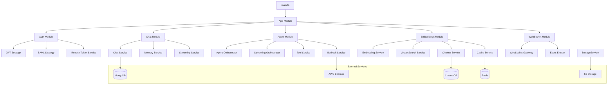
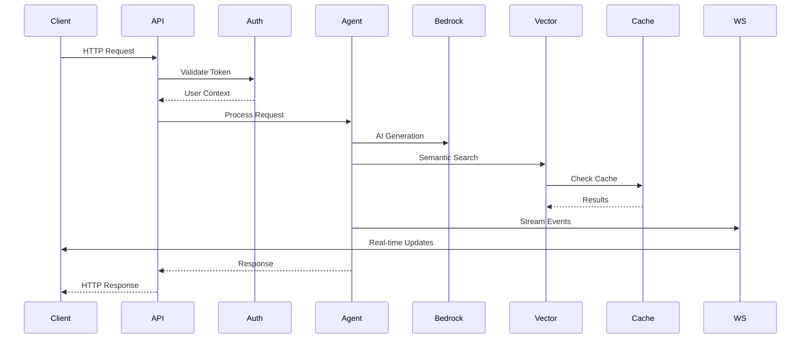

# Backend Node.js - Advanced AI Learning Platform

## Overview

**MFU Learn AI Backend Node.js** is a comprehensive NestJS-based backend system that provides advanced AI capabilities, real-time communication, and scalable architecture for educational AI applications.

### Core Features
- 🤖 **AI Agent Orchestration**: Advanced agent management with tool execution
- 🔄 **Real-time Streaming**: Token-by-token AI response streaming
- 🌐 **WebSocket Integration**: Full-duplex real-time communication
- 🔍 **Vector Embeddings**: Semantic search and similarity matching
- 🛡️ **Type Safety**: Complete Zod validation throughout
- ⚡ **Performance**: Intelligent caching and optimization
- 🔧 **Error Handling**: Comprehensive exception management
- 📊 **Analytics**: Performance monitoring and metrics

---

## Architecture Overview

### 🏗️ Core Architecture

```
backend-node/
├── src/
│   ├── modules/                    # Feature modules
│   │   ├── auth/                   # Authentication & Authorization
│   │   ├── chat/                   # Chat functionality
│   │   ├── agents/                 # AI Agent management
│   │   ├── embeddings/             # Vector operations
│   │   ├── collections/            # Document collections
│   │   ├── upload/                 # File management
│   │   ├── admin/                  # Admin functions
│   │   ├── ws/                     # WebSocket gateway
│   │   └── ...                     # Other modules
│   │
│   ├── services/                   # Core services
│   │   ├── embedding.service.ts    # Vector embeddings
│   │   ├── bedrock.service.ts      # AWS Bedrock integration
│   │   ├── chroma.service.ts       # Vector database
│   │   ├── cache.service.ts        # Redis caching
│   │   ├── streaming.service.ts    # Real-time streaming
│   │   └── ...                     # Other services
│   │
│   ├── common/                     # Shared utilities
│   │   ├── schemas/                # Zod validation schemas
│   │   ├── exceptions/             # Custom exceptions
│   │   ├── filters/                # Global filters
│   │   ├── interceptors/           # Request interceptors
│   │   └── decorators/             # Custom decorators
│   │
│   └── main.ts                     # Application entry point
│
├── package.json                    # Dependencies
├── tsconfig.json                   # TypeScript config
└── README.md                       # This file
```

### 🔧 System Components

#### **1. Authentication & Authorization**
- **JWT-based Authentication**: Secure token-based auth
- **Role-based Access Control**: Multi-level permission system
- **SAML Integration**: Enterprise SSO support
- **Session Management**: Secure session handling

#### **2. AI Agent System**
- **Agent Orchestration**: Multi-agent coordination
- **Tool Execution**: Dynamic tool calling
- **Streaming Responses**: Real-time token delivery
- **Memory Management**: Conversation context handling

#### **3. Vector Database Integration**
- **Embedding Generation**: AWS Bedrock Titan models
- **Semantic Search**: Advanced similarity matching
- **ChromaDB Storage**: Scalable vector database
- **Intelligent Caching**: Redis-based optimization

#### **4. Real-time Communication**
- **WebSocket Gateway**: Full-duplex communication
- **Event System**: EventEmitter2 integration
- **Stream Management**: Session-based streaming
- **Real-time Analytics**: Live performance metrics

#### **5. Data Management**
- **Document Processing**: PDF, text, and file handling
- **Collection Management**: Organized knowledge base
- **Storage Service**: S3-compatible storage
- **Queue System**: BullMQ job processing

---

## System Integration Map

### 🔗 Service Dependencies



### 📊 Data Flow Architecture



---

## Technology Stack

### 🚀 Core Technologies

| Component | Technology | Version | Purpose |
|-----------|------------|---------|---------|
| **Framework** | NestJS | Latest | Enterprise Node.js framework |
| **Language** | TypeScript | Latest | Type-safe JavaScript |
| **Database** | MongoDB | Latest | Document database |
| **Cache** | Redis | Latest | In-memory caching |
| **Vector DB** | ChromaDB | 3.0.6 | Vector embeddings storage |
| **AI Service** | AWS Bedrock | Latest | AI model integration |
| **WebSocket** | Socket.IO | Latest | Real-time communication |
| **Queue** | BullMQ | Latest | Background job processing |
| **Validation** | Zod | Latest | Schema validation |

### 📦 Key Dependencies

```json
{
  "core": {
    "@nestjs/common": "latest",
    "@nestjs/core": "latest",
    "@nestjs/mongoose": "latest",
    "@nestjs/websockets": "latest",
    "@nestjs/event-emitter": "latest"
  },
  "ai": {
    "@aws-sdk/client-bedrock-runtime": "^3.842.0",
    "chromadb": "^3.0.6"
  },
  "validation": {
    "zod": "^3.25.74",
    "class-validator": "^0.14.2"
  },
  "storage": {
    "mongoose": "latest",
    "ioredis": "latest",
    "bullmq": "latest"
  }
}
```

---

## System Testing Plan

### 🧪 Integration Testing Strategy

#### **Phase 1: Core System Testing**

##### **1.1 Database Connectivity**
```bash
# Test MongoDB connection
curl -X GET http://localhost:5000/health
# Expected: {"status": "ok", "database": "connected"}

# Test Redis connection
curl -X GET http://localhost:5000/health/redis
# Expected: {"status": "ok", "redis": "connected"}

# Test ChromaDB connection
curl -X GET http://localhost:5000/health/chroma
# Expected: {"status": "ok", "chroma": "connected"}
```

##### **1.2 Authentication System**
```bash
# Test user registration
curl -X POST http://localhost:5000/auth/register \
  -H "Content-Type: application/json" \
  -d '{"username": "test", "password": "test123", "email": "test@example.com"}'

# Test login
curl -X POST http://localhost:5000/auth/login \
  -H "Content-Type: application/json" \
  -d '{"username": "test", "password": "test123"}'

# Test token refresh
curl -X POST http://localhost:5000/auth/refresh \
  -H "Authorization: Bearer REFRESH_TOKEN"
```

##### **1.3 Agent System**
```bash
# Test agent creation
curl -X POST http://localhost:5000/agents \
  -H "Content-Type: application/json" \
  -H "Authorization: Bearer JWT_TOKEN" \
  -d '{"name": "TestAgent", "systemPrompt": "You are a helpful assistant"}'

# Test agent execution
curl -X POST http://localhost:5000/agents/execute \
  -H "Content-Type: application/json" \
  -H "Authorization: Bearer JWT_TOKEN" \
  -d '{"agentId": "AGENT_ID", "message": "Hello"}'
```

#### **Phase 2: Advanced Feature Testing**

##### **2.1 Vector Embeddings**
```bash
# Test batch embedding creation
curl -X POST http://localhost:5000/embeddings/batch \
  -H "Content-Type: application/json" \
  -H "Authorization: Bearer JWT_TOKEN" \
  -d '{
    "texts": ["AI is amazing", "Machine learning is powerful"],
    "modelId": "amazon.titan-embed-text-v1"
  }'

# Test semantic search
curl -X POST http://localhost:5000/embeddings/search \
  -H "Content-Type: application/json" \
  -H "Authorization: Bearer JWT_TOKEN" \
  -d '{
    "query": "artificial intelligence",
    "collectionId": "COLLECTION_ID",
    "topK": 5
  }'
```

##### **2.2 Real-time Streaming**
```bash
# Test streaming agent execution
curl -X POST http://localhost:5000/agents/execute-streaming \
  -H "Content-Type: application/json" \
  -H "Authorization: Bearer JWT_TOKEN" \
  -d '{
    "agentId": "AGENT_ID",
    "message": "Tell me a story",
    "streaming": true
  }'
```

##### **2.3 WebSocket Communication**
```javascript
// WebSocket connection test
const socket = io('http://localhost:5000', {
  auth: { token: 'JWT_TOKEN' }
});

// Test room joining
socket.emit('join-room', { roomId: 'test-room' });

// Test message sending
socket.emit('send-message', { 
  roomId: 'test-room', 
  message: 'Hello World' 
});

// Test streaming subscription
socket.emit('subscribe-stream', { 
  sessionId: 'SESSION_ID' 
});
```

#### **Phase 3: Performance & Load Testing**

##### **3.1 Concurrent User Testing**
```bash
# Test concurrent chat sessions
for i in {1..10}; do
  curl -X POST http://localhost:5000/chat \
    -H "Content-Type: application/json" \
    -H "Authorization: Bearer JWT_TOKEN_$i" \
    -d '{"message": "Hello from user $i"}' &
done
```

##### **3.2 Memory & Performance**
```bash
# Monitor memory usage
curl -X GET http://localhost:5000/monitoring/memory

# Check performance metrics
curl -X GET http://localhost:5000/monitoring/performance

# Test cache performance
curl -X GET http://localhost:5000/embeddings/cache/stats
```

### 🔍 Health Monitoring

#### **System Health Endpoints**
```bash
# Overall system health
GET /health                    # Basic health check
GET /health/detailed           # Detailed system status
GET /health/services           # Individual service status

# Performance monitoring
GET /monitoring/performance    # System performance metrics
GET /monitoring/memory         # Memory usage statistics
GET /monitoring/database       # Database performance

# Service-specific health
GET /embeddings/health         # Vector embeddings health
GET /chat/health              # Chat system health
GET /agents/health            # Agent system health
```

---

## Environment Configuration

### 🔧 Required Environment Variables

```env
# Server Configuration
PORT=5000
NODE_ENV=development
FRONTEND_URL=http://localhost:3000

# Database Configuration
MONGODB_URI=mongodb://localhost:27017/mfu_chatbot
REDIS_URL=redis://localhost:6379

# AWS Configuration
AWS_REGION=us-east-1
AWS_ACCESS_KEY_ID=your_access_key
AWS_SECRET_ACCESS_KEY=your_secret_key

# Vector Database
CHROMA_URL=http://localhost:8000

# Authentication
JWT_SECRET=your_jwt_secret
JWT_EXPIRES_IN=24h
REFRESH_TOKEN_SECRET=your_refresh_secret

# External Services
S3_BUCKET_NAME=your_bucket_name
BEDROCK_MODEL_ID=amazon.titan-embed-text-v1
```

### 📋 Pre-deployment Checklist

#### **System Requirements**
- [ ] Node.js 20+ installed
- [ ] MongoDB running and accessible
- [ ] Redis running and accessible
- [ ] ChromaDB running and accessible
- [ ] AWS Bedrock access configured
- [ ] S3 bucket configured (if using file storage)

#### **Security Configuration**
- [ ] JWT secrets configured
- [ ] CORS origins properly set
- [ ] Rate limiting enabled
- [ ] Security headers configured
- [ ] Input validation active

#### **Performance Optimization**
- [ ] Redis caching enabled
- [ ] Database indexes created
- [ ] Connection pooling configured
- [ ] Graceful shutdown handlers active
- [ ] Memory limits set

---

## Quick Start Guide

### 🚀 Development Setup

1. **Install Dependencies**
```bash
npm install
```

2. **Set Environment Variables**
```bash
cp .env.example .env
# Edit .env with your configuration
```

3. **Start Development Server**
```bash
npm run start:dev
```

4. **Access Services**
- **API**: http://localhost:5000
- **Documentation**: http://localhost:5000/docs
- **Health Check**: http://localhost:5000/health

### 📦 Production Deployment

1. **Build Application**
```bash
npm run build
```

2. **Start Production Server**
```bash
npm run start
```

3. **Verify Deployment**
```bash
curl -X GET http://localhost:5000/health
```

---

## Development Status

### ✅ Completed Features

| Feature | Status | Description |
|---------|--------|-------------|
| **Core Architecture** | ✅ | NestJS framework with 25+ modules |
| **Authentication** | ✅ | JWT + SAML authentication |
| **AI Agent System** | ✅ | Multi-agent orchestration |
| **Vector Embeddings** | ✅ | Semantic search & similarity |
| **Real-time Streaming** | ✅ | Token-by-token AI responses |
| **WebSocket Integration** | ✅ | Full-duplex communication |
| **Type Safety** | ✅ | Complete Zod validation |
| **Error Handling** | ✅ | Comprehensive exception management |
| **Performance** | ✅ | Caching & optimization |
| **Monitoring** | ✅ | Health checks & metrics |

### 🔄 Next Phase: Performance & Scalability

#### **Phase 3 Roadmap**
- [ ] **Load Balancing**: Multi-instance deployment
- [ ] **Database Sharding**: Horizontal scaling
- [ ] **Microservices**: Service decomposition
- [ ] **Container Orchestration**: Kubernetes deployment
- [ ] **Advanced Monitoring**: Prometheus & Grafana
- [ ] **Auto-scaling**: Dynamic resource management

---

## Support & Documentation

### 📚 Additional Resources
- **API Documentation**: http://localhost:5000/docs
- **Health Dashboard**: http://localhost:5000/health
- **Performance Metrics**: http://localhost:5000/monitoring

### 🐛 Troubleshooting
- Check environment variables configuration
- Verify external service connectivity
- Monitor logs for error details
- Use health endpoints for system status

---

**Version**: 0.1.0  
**Last Updated**: December 21, 2024  
**Status**: Production Ready (Phase 1 & 2 Complete)
