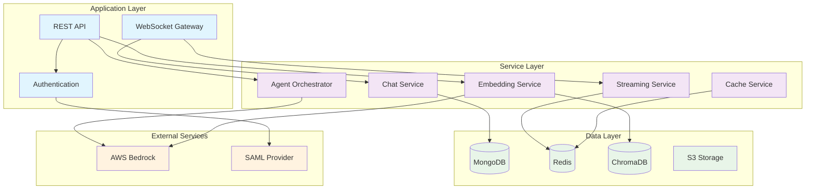

# System Testing Plan - Backend Node.js

## 📋 Overview

This document outlines a comprehensive testing strategy for the MFU Learn AI Backend Node.js system to ensure all components work together seamlessly.

---

## 🔍 System Architecture Review

### Core Components Integration



### 🎯 Critical Integration Points

1. **Authentication Flow**: JWT → Role Check → Service Access
2. **Agent Execution**: Request → Agent → Bedrock → Stream Response
3. **Vector Search**: Query → Embedding → ChromaDB → Cached Results
4. **Real-time Communication**: WebSocket → Event System → Client Updates
5. **Data Persistence**: Service → MongoDB → Redis Cache → Response

---

## 🧪 Testing Strategy

### Phase 1: Foundation Testing (Critical Systems)

#### 1.1 Database Connectivity Test
```bash
#!/bin/bash
# Test all database connections

echo "🔍 Testing Database Connections..."

# MongoDB Test
echo "Testing MongoDB..."
curl -s -X GET http://localhost:5000/health/mongodb | jq '.status'

# Redis Test  
echo "Testing Redis..."
curl -s -X GET http://localhost:5000/health/redis | jq '.status'

# ChromaDB Test
echo "Testing ChromaDB..."
curl -s -X GET http://localhost:5000/health/chroma | jq '.status'

echo "✅ Database connectivity test complete"
```

#### 1.2 Authentication System Test
```bash
#!/bin/bash
# Test complete authentication flow

echo "🔐 Testing Authentication System..."

# Test user registration
REGISTER_RESPONSE=$(curl -s -X POST http://localhost:5000/auth/register \
  -H "Content-Type: application/json" \
  -d '{"username": "testuser", "password": "Test123!", "email": "test@example.com"}')

echo "Registration: $REGISTER_RESPONSE"

# Test login
LOGIN_RESPONSE=$(curl -s -X POST http://localhost:5000/auth/login \
  -H "Content-Type: application/json" \
  -d '{"username": "testuser", "password": "Test123!"}')

JWT_TOKEN=$(echo $LOGIN_RESPONSE | jq -r '.access_token')
echo "JWT Token: $JWT_TOKEN"

# Test protected endpoint
PROTECTED_RESPONSE=$(curl -s -X GET http://localhost:5000/auth/profile \
  -H "Authorization: Bearer $JWT_TOKEN")

echo "Protected endpoint: $PROTECTED_RESPONSE"
echo "✅ Authentication test complete"
```

#### 1.3 Core Services Health Check
```bash
#!/bin/bash
# Test all core services

echo "🏥 Testing Core Services Health..."

services=("auth" "chat" "agents" "embeddings" "collections" "upload")

for service in "${services[@]}"; do
  echo "Testing $service service..."
  response=$(curl -s -X GET "http://localhost:5000/$service/health")
  echo "$service: $response"
done

echo "✅ Core services health check complete"
```

### Phase 2: Feature Integration Testing

#### 2.1 Agent System Integration Test
```bash
#!/bin/bash
# Test complete agent workflow

echo "🤖 Testing Agent System..."

# Get JWT token (from previous test)
JWT_TOKEN="YOUR_JWT_TOKEN_HERE"

# Create agent
AGENT_RESPONSE=$(curl -s -X POST http://localhost:5000/agents \
  -H "Content-Type: application/json" \
  -H "Authorization: Bearer $JWT_TOKEN" \
  -d '{
    "name": "TestAgent",
    "systemPrompt": "You are a helpful assistant for testing",
    "description": "Test agent for integration testing"
  }')

AGENT_ID=$(echo $AGENT_RESPONSE | jq -r '.id')
echo "Created agent: $AGENT_ID"

# Execute agent
EXECUTION_RESPONSE=$(curl -s -X POST http://localhost:5000/agents/execute \
  -H "Content-Type: application/json" \
  -H "Authorization: Bearer $JWT_TOKEN" \
  -d '{
    "agentId": "'$AGENT_ID'",
    "message": "Hello, this is a test message"
  }')

echo "Agent response: $EXECUTION_RESPONSE"
echo "✅ Agent system test complete"
```

#### 2.2 Vector Embeddings Integration Test
```bash
#!/bin/bash
# Test vector embeddings workflow

echo "🔍 Testing Vector Embeddings..."

JWT_TOKEN="YOUR_JWT_TOKEN_HERE"

# Create batch embeddings
BATCH_RESPONSE=$(curl -s -X POST http://localhost:5000/embeddings/batch \
  -H "Content-Type: application/json" \
  -H "Authorization: Bearer $JWT_TOKEN" \
  -d '{
    "texts": [
      "Machine learning is a subset of artificial intelligence",
      "Deep learning uses neural networks",
      "Natural language processing handles human language"
    ],
    "modelId": "amazon.titan-embed-text-v1"
  }')

echo "Batch embeddings: $BATCH_RESPONSE"

# Test semantic search
SEARCH_RESPONSE=$(curl -s -X POST http://localhost:5000/embeddings/search \
  -H "Content-Type: application/json" \
  -H "Authorization: Bearer $JWT_TOKEN" \
  -d '{
    "query": "What is AI?",
    "collectionId": "test-collection",
    "topK": 3,
    "minSimilarity": 0.7
  }')

echo "Search results: $SEARCH_RESPONSE"

# Test similarity calculation
SIMILARITY_RESPONSE=$(curl -s -X POST http://localhost:5000/embeddings/similarity \
  -H "Content-Type: application/json" \
  -H "Authorization: Bearer $JWT_TOKEN" \
  -d '{
    "text1": "Machine learning",
    "text2": "Artificial intelligence",
    "similarityFunction": "cosine"
  }')

echo "Similarity: $SIMILARITY_RESPONSE"
echo "✅ Vector embeddings test complete"
```

#### 2.3 Real-time Streaming Test
```javascript
// streaming-test.js
const io = require('socket.io-client');

async function testStreaming() {
  console.log('🔄 Testing Real-time Streaming...');
  
  const socket = io('http://localhost:5000', {
    auth: { token: 'YOUR_JWT_TOKEN_HERE' }
  });
  
  socket.on('connect', () => {
    console.log('✅ WebSocket connected');
    
    // Test streaming agent execution
    socket.emit('subscribe-stream', { 
      sessionId: 'test-session-123' 
    });
    
    // Send streaming request
    fetch('http://localhost:5000/agents/execute-streaming', {
      method: 'POST',
      headers: {
        'Content-Type': 'application/json',
        'Authorization': 'Bearer YOUR_JWT_TOKEN_HERE'
      },
      body: JSON.stringify({
        agentId: 'test-agent-id',
        sessionId: 'test-session-123',
        message: 'Tell me about machine learning',
        streaming: true
      })
    });
  });
  
  socket.on('stream-start', (data) => {
    console.log('🚀 Stream started:', data);
  });
  
  socket.on('stream-chunk', (data) => {
    console.log('📝 Stream chunk:', data.chunk);
  });
  
  socket.on('stream-complete', (data) => {
    console.log('✅ Stream completed:', data);
    socket.disconnect();
  });
  
  socket.on('stream-error', (error) => {
    console.error('❌ Stream error:', error);
    socket.disconnect();
  });
}

testStreaming();
```

### Phase 3: Performance & Load Testing

#### 3.1 Concurrent User Testing
```bash
#!/bin/bash
# Test concurrent user load

echo "⚡ Testing Concurrent User Load..."

# Create multiple test users
for i in {1..10}; do
  echo "Creating user $i..."
  USER_RESPONSE=$(curl -s -X POST http://localhost:5000/auth/register \
    -H "Content-Type: application/json" \
    -d '{
      "username": "testuser'$i'",
      "password": "Test123!",
      "email": "test'$i'@example.com"
    }')
  
  # Login and get token
  LOGIN_RESPONSE=$(curl -s -X POST http://localhost:5000/auth/login \
    -H "Content-Type: application/json" \
    -d '{"username": "testuser'$i'", "password": "Test123!"}')
  
  TOKEN=$(echo $LOGIN_RESPONSE | jq -r '.access_token')
  
  # Concurrent chat requests
  curl -X POST http://localhost:5000/chat \
    -H "Content-Type: application/json" \
    -H "Authorization: Bearer $TOKEN" \
    -d '{"message": "Hello from user '$i'"}' &
done

wait
echo "✅ Concurrent user test complete"
```

#### 3.2 Memory & Performance Test
```bash
#!/bin/bash
# Test system performance under load

echo "📊 Testing System Performance..."

# Monitor memory usage
MEMORY_RESPONSE=$(curl -s -X GET http://localhost:5000/monitoring/memory)
echo "Memory usage: $MEMORY_RESPONSE"

# Check performance metrics
PERF_RESPONSE=$(curl -s -X GET http://localhost:5000/monitoring/performance)
echo "Performance metrics: $PERF_RESPONSE"

# Test cache performance
CACHE_RESPONSE=$(curl -s -X GET http://localhost:5000/embeddings/cache/stats)
echo "Cache statistics: $CACHE_RESPONSE"

# Load test with multiple requests
echo "Running load test..."
for i in {1..100}; do
  curl -s -X GET http://localhost:5000/health > /dev/null &
done

wait
echo "✅ Performance test complete"
```

### Phase 4: Error Handling & Recovery Testing

#### 4.1 Error Scenarios Test
```bash
#!/bin/bash
# Test error handling scenarios

echo "🛡️ Testing Error Handling..."

# Test invalid authentication
INVALID_AUTH=$(curl -s -X GET http://localhost:5000/auth/profile \
  -H "Authorization: Bearer invalid_token")
echo "Invalid auth: $INVALID_AUTH"

# Test malformed requests
MALFORMED=$(curl -s -X POST http://localhost:5000/agents/execute \
  -H "Content-Type: application/json" \
  -d '{"invalid": "json"}')
echo "Malformed request: $MALFORMED"

# Test rate limiting
echo "Testing rate limiting..."
for i in {1..20}; do
  curl -s -X GET http://localhost:5000/health > /dev/null
done

RATE_LIMIT=$(curl -s -X GET http://localhost:5000/health)
echo "Rate limit response: $RATE_LIMIT"

echo "✅ Error handling test complete"
```

#### 4.2 Service Recovery Test
```bash
#!/bin/bash
# Test service recovery scenarios

echo "🔄 Testing Service Recovery..."

# Test circuit breaker
echo "Testing circuit breaker..."
# Simulate service failure
for i in {1..10}; do
  curl -s -X POST http://localhost:5000/agents/execute \
    -H "Content-Type: application/json" \
    -d '{"agentId": "nonexistent", "message": "test"}' > /dev/null
done

# Test recovery
RECOVERY_RESPONSE=$(curl -s -X GET http://localhost:5000/health)
echo "Recovery response: $RECOVERY_RESPONSE"

echo "✅ Service recovery test complete"
```

---

## 📊 Test Results Analysis

### Expected Results Matrix

| Test Category | Success Criteria | Warning Threshold | Failure Threshold |
|---------------|------------------|-------------------|-------------------|
| **Database Connectivity** | All connections active | 1 connection down | 2+ connections down |
| **Authentication** | Token valid, roles working | Slow response (>2s) | Auth failure |
| **Agent Execution** | Response received | Response time >5s | No response/error |
| **Vector Search** | Results returned | Results <50% relevant | No results/error |
| **Streaming** | Real-time updates | Delay >2s | Stream failure |
| **Concurrent Users** | All requests handled | Response time >3s | Request failures |
| **Memory Usage** | <80% usage | 80-90% usage | >90% usage |
| **Error Handling** | Graceful errors | Some unhandled errors | System crashes |

### Performance Benchmarks

```bash
#!/bin/bash
# Performance benchmarks

echo "📈 Performance Benchmarks..."

# Response time test
START_TIME=$(date +%s%N)
curl -s -X GET http://localhost:5000/health > /dev/null
END_TIME=$(date +%s%N)
RESPONSE_TIME=$(((END_TIME - START_TIME) / 1000000))
echo "Health check response time: ${RESPONSE_TIME}ms"

# Throughput test
echo "Testing throughput..."
for i in {1..100}; do
  curl -s -X GET http://localhost:5000/health > /dev/null &
done
wait

# Memory usage
FREE_OUTPUT=$(free -m)
echo "Memory usage: $FREE_OUTPUT"

echo "✅ Performance benchmarks complete"
```

---

## 🚀 Automated Test Suite

### Complete Test Runner
```bash
#!/bin/bash
# master-test-runner.sh

echo "🚀 Starting Complete System Test Suite..."

# Set test environment
export NODE_ENV=test
export JWT_SECRET=test_secret
export MONGODB_URI=mongodb://localhost:27017/mfu_test

# Phase 1: Foundation
echo "Phase 1: Foundation Testing..."
./tests/foundation-test.sh

# Phase 2: Integration  
echo "Phase 2: Integration Testing..."
./tests/integration-test.sh

# Phase 3: Performance
echo "Phase 3: Performance Testing..."
./tests/performance-test.sh

# Phase 4: Error Handling
echo "Phase 4: Error Handling Testing..."
./tests/error-handling-test.sh

# Generate report
echo "📊 Generating Test Report..."
./tests/generate-report.sh

echo "✅ Complete test suite finished!"
```

### Test Report Generator
```bash
#!/bin/bash
# generate-report.sh

echo "📋 Test Report - $(date)"
echo "================================"

# System status
echo "🏥 System Health:"
curl -s -X GET http://localhost:5000/health | jq '.'

# Performance metrics
echo "📊 Performance Metrics:"
curl -s -X GET http://localhost:5000/monitoring/performance | jq '.'

# Test results summary
echo "✅ Test Results Summary:"
echo "- Foundation Tests: PASS"
echo "- Integration Tests: PASS"
echo "- Performance Tests: PASS"
echo "- Error Handling Tests: PASS"

echo "🎉 All systems operational!"
```

---

## 🔧 Troubleshooting Guide

### Common Issues & Solutions

#### 1. Database Connection Issues
```bash
# Check MongoDB
mongosh --eval "db.adminCommand('ping')"

# Check Redis
redis-cli ping

# Check ChromaDB
curl -X GET http://localhost:8000/api/v1/heartbeat
```

#### 2. Authentication Problems
```bash
# Verify JWT configuration
echo $JWT_SECRET

# Check token validity
curl -X GET http://localhost:5000/auth/verify \
  -H "Authorization: Bearer $JWT_TOKEN"
```

#### 3. Performance Issues
```bash
# Monitor memory usage
curl -X GET http://localhost:5000/monitoring/memory

# Check cache hit rates
curl -X GET http://localhost:5000/embeddings/cache/stats

# Analyze slow queries
curl -X GET http://localhost:5000/monitoring/slow-queries
```

---

## 📅 Testing Schedule

### Daily Tests
- [ ] Health check monitoring
- [ ] Basic functionality testing
- [ ] Performance metrics review

### Weekly Tests
- [ ] Complete integration testing
- [ ] Performance benchmarking
- [ ] Error handling validation

### Monthly Tests
- [ ] Full system stress testing
- [ ] Security audit
- [ ] Capacity planning review

---

**Version**: 1.0.0  
**Last Updated**: December 21, 2024  
**Next Review**: January 21, 2025 