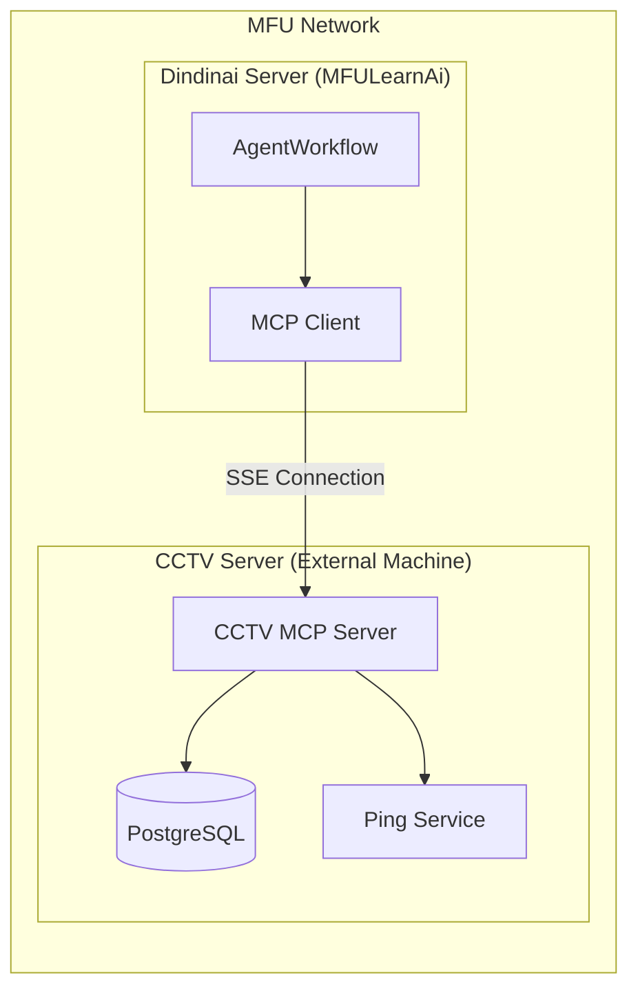

# MCP Deployment Architecture

This directory contains the Model Context Protocol (MCP) implementation for the CCTV integration.

## Architecture



## Deployment Steps

### 1. CCTV Server (Remote Machine)
On your CCTV server (e.g., `192.168.x.x` or `cctv-server`), run the MCP Server:

1. Copy `CCTVServer.ts` (and `package.json` dependencies).
2. Install dependencies: `npm install express cors uuid`.
3. Set port (optional): `export MCP_PORT=3001`.
4. Run the server:
   ```bash
   npx ts-node CCTVServer.ts
   # or compile to js and run
   node CCTVServer.js
   ```
   
   *Note: Modify `CCTVServer.ts` to connect to your real PostgreSQL database instead of the mock `data/cameras.json`.*

### 2. Dindinai Server (This Project)
Configure the backend to connect to the remote CCTV server.

1. Open `.env` (or your deployment config).
2. Add the variable:
   ```env
   MCP_CCTV_URL=http://<CCTV_SERVER_IP>:3001
   ```
   *(Replace `<CCTV_SERVER_IP>` with the actual address of the CCTV server)*

### 3. Verify
Restart the Dindinai backend. The `AgentWorkflow` will detect the `MCP_CCTV_URL` and connect to it automatically instead of spawning the local mock server.

## Troubleshooting
- **Connection Refused**: Check if port 3001 is open on the CCTV server firewall.
- **SSE Errors**: Ensure the network allows long-lived HTTP connections (timeouts).
