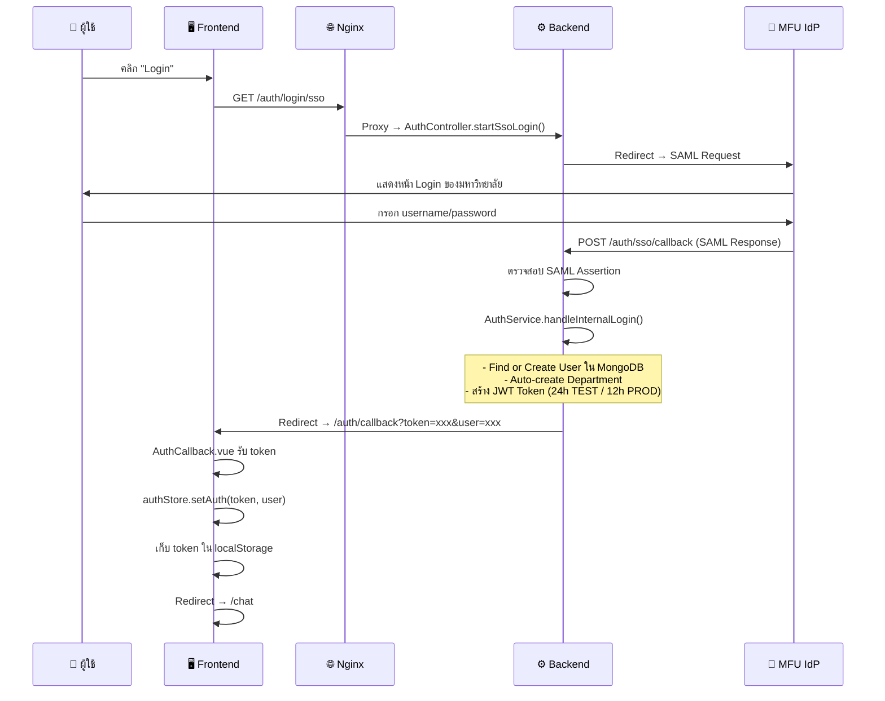
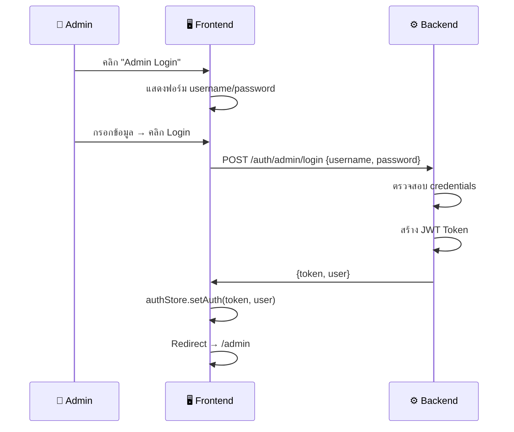
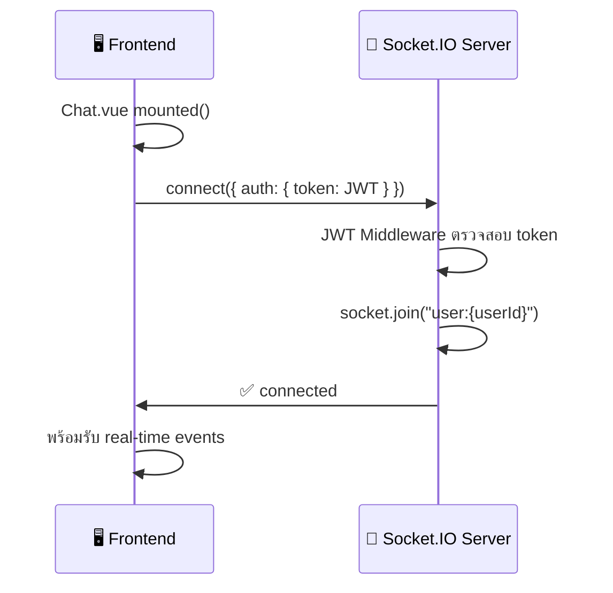
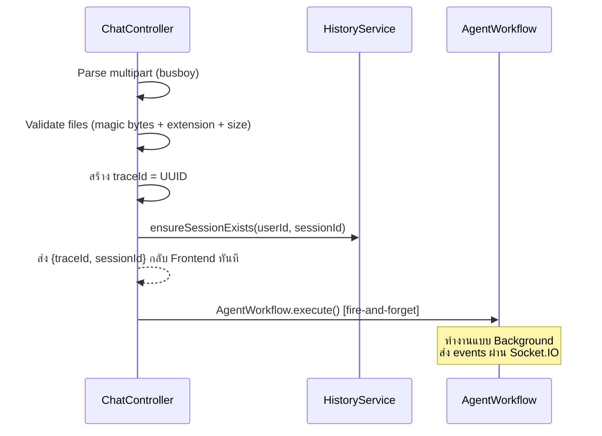
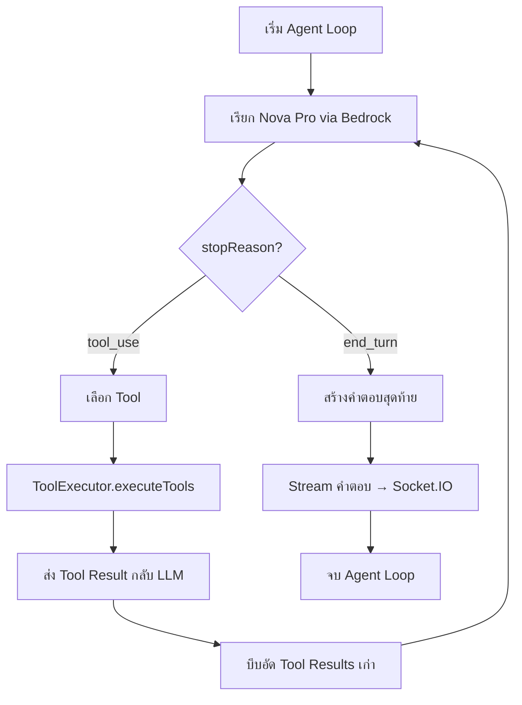
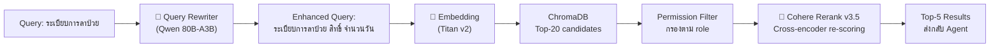
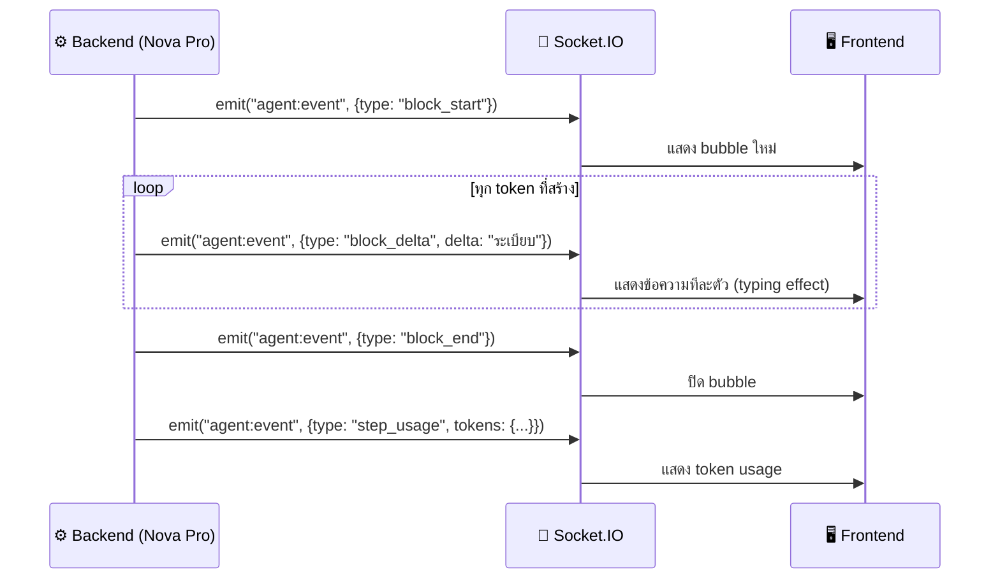
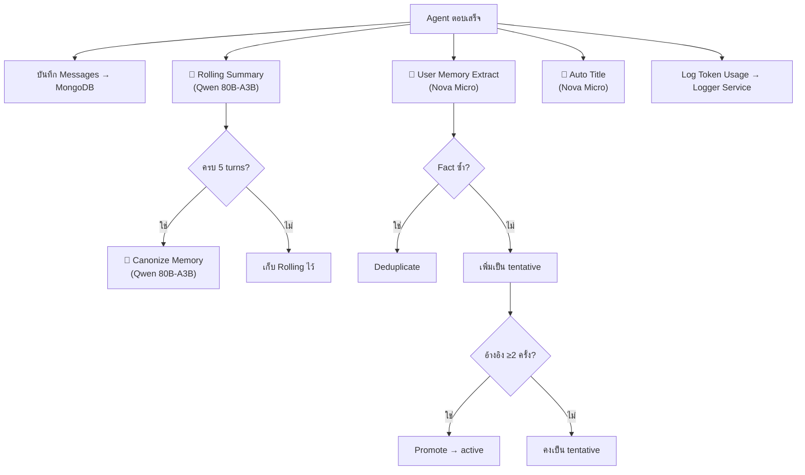
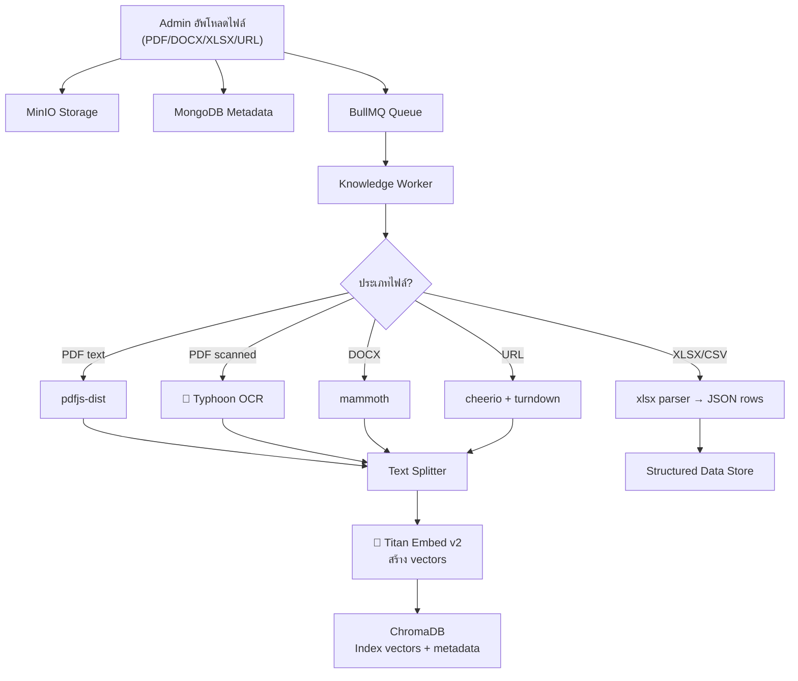

# 🚀 MFULearnAI — Step-by-Step Workflow Guide

> คู่มืออธิบายขั้นตอนการทำงานของระบบตั้งแต่ Login จนถึงได้คำตอบ

---

## 📋 สารบัญ

1. [ขั้นตอนที่ 1: Login & Authentication](#step-1)
2. [ขั้นตอนที่ 2: เข้าสู่หน้า Chat](#step-2)
3. [ขั้นตอนที่ 3: ส่งข้อความ](#step-3)
4. [ขั้นตอนที่ 4: Backend รับข้อความ](#step-4)
5. [ขั้นตอนที่ 5: Agent Workflow เริ่มทำงาน](#step-5)
6. [ขั้นตอนที่ 6: AI ประมวลผลและเลือก Tool](#step-6)
7. [ขั้นตอนที่ 7: RAG Search (ค้นหาข้อมูล)](#step-7)
8. [ขั้นตอนที่ 8: สร้างคำตอบและ Stream กลับ](#step-8)
9. [ขั้นตอนที่ 9: บันทึกและอัพเดท Memory](#step-9)
10. [ขั้นตอนที่ 10: Knowledge Upload](#step-10)

---

<a id="step-1"></a>
## 🔐 ขั้นตอนที่ 1: Login & Authentication

### ผู้ใช้เปิดหน้า Login

```
ผู้ใช้เปิด Browser → https://mfulearnai.mfu.ac.th/login
```

**หน้า Login** (`Login.vue`) แสดง:
- พื้นหลังเปลี่ยนตามเวลา (เช้า/กลางวัน/เย็น/กลางคืน)
- ปุ่ม **"Login"** (SSO) — สำหรับนักศึกษา/บุคลากร
- ลิงก์ **"Admin Login"** — สำหรับ admin

### 1.1 SSO Login (นักศึกษา/บุคลากร)



### 1.2 Admin Login (Username/Password)



### JWT Token ประกอบด้วย:

| Field | คำอธิบาย |
|-------|---------|
| `userId` | ID ของผู้ใช้ |
| `role` | สิทธิ์: student / staff / admin / superadmin |
| `email` | อีเมล |
| `department` | สังกัด |
| `permissions` | สิทธิ์พิเศษ |
| `environment` | TEST หรือ PROD |

---

<a id="step-2"></a>
## 💬 ขั้นตอนที่ 2: เข้าสู่หน้า Chat

### 2.1 เชื่อมต่อ Socket.IO



### 2.2 โหลดข้อมูลเริ่มต้น

```
Frontend ทำพร้อมกัน:
├── GET /api/chat          → โหลดรายการ sessions (sidebar)
├── GET /api/chat/models   → โหลดโมเดล AI ที่ใช้ได้
└── GET /api/knowledge     → โหลด Knowledge Collections
```

### 2.3 หน้า Chat แสดง

```
┌─────────────────────────────────────────────────┐
│  ┌──────────┐  ┌─────────────────────────────┐  │
│  │ Sidebar  │  │       Chat Area             │  │
│  │          │  │                             │  │
│  │ Sessions │  │  Welcome Screen             │  │
│  │ - Chat 1 │  │  "สวัสดี! ถามอะไรได้เลย"     │  │
│  │ - Chat 2 │  │                             │  │
│  │ - Chat 3 │  │                             │  │
│  │          │  ├─────────────────────────────┤  │
│  │ [+ New]  │  │ [📎 แนบไฟล์] [พิมพ์...] [➤] │  │
│  └──────────┘  └─────────────────────────────┘  │
└─────────────────────────────────────────────────┘
```

---

<a id="step-3"></a>
## ✍️ ขั้นตอนที่ 3: ผู้ใช้ส่งข้อความ

### 3.1 พิมพ์ข้อความ + แนบไฟล์ (ถ้ามี)

```
ผู้ใช้พิมพ์: "ระเบียบการลาป่วยเป็นยังไง"
(อาจแนบ: รูปภาพ, PDF, DOCX, XLSX, TXT)
```

### 3.2 Frontend เตรียมข้อมูล (`chat.js` store)

```javascript
// 1. สร้าง session ID (ถ้ายังไม่มี)
sessionId = crypto.randomUUID()

// 2. เพิ่ม user message ลง UI ทันที
messages.push({ role: 'user', content: '...', timestamp: new Date() })

// 3. สร้าง assistant message placeholder
messages.push({ role: 'assistant', content: '', agentEvents: [] })

// 4. เริ่มฟัง Socket.IO events ก่อนส่ง request
socket.on('agent:event', handleEvent)

// 5. ส่ง HTTP request
FormData = { message, sessionId, modelId, collectionId, files[] }
POST /api/chat (multipart/form-data)
```

> ⚡ **สำคัญ**: Frontend ฟัง Socket.IO **ก่อน** ส่ง HTTP request เพื่อป้องกัน race condition

---

<a id="step-4"></a>
## ⚙️ ขั้นตอนที่ 4: Backend รับข้อความ

### 4.1 Request ผ่าน Middleware Chain

```
Request →
│
├── 🌐 Nginx: Rate Limit, SSL, Proxy
│
├── 🔑 AuthService.authenticateUser()
│   └── ตรวจ JWT Token หรือ API Key (sk_xxx)
│
├── 🚦 RateLimiter.limit()
│   └── จำกัด requests/นาที ต่อ user
│
├── 💰 quotaEnforcer()
│   └── ตรวจโควต้า weighted tokens ประจำวัน
│
├── 🛡️ validateChatContent()
│   └── ตรวจเนื้อหาข้อความ + ไฟล์
│
└── 📨 ChatController.chat()
```

### 4.2 ChatController ทำงาน



> 🔥 **Fire-and-Forget**: Backend ตอบกลับ `{traceId, sessionId}` ทันที ไม่รอผล AI

---

<a id="step-5"></a>
## 🧠 ขั้นตอนที่ 5: Agent Workflow เริ่มทำงาน

### 5.1 โหลด Context

```
AgentWorkflow.execute()
│
├── [5.1.1] ContextLoader.loadContext()
│   ├── ดึง Chat History จาก Redis/MongoDB
│   ├── ดึง SmartContext (Rolling + Canonical Memory)
│   └── ดึง User Memory (cross-session facts)
│
├── [5.1.2] FileProcessor.processFiles()
│   ├── ไฟล์ที่ Bedrock รองรับ → NativeFileBlock
│   ├── ไฟล์ต้อง OCR → BullMQ Queue → OCR Service
│   │   └── 🤖 Typhoon OCR 1.5 (หรือ Tesseract fallback)
│   └── อัพโหลดไฟล์ → MinIO
│
├── [5.1.3] Initialize Tools
│   ├── search (ค้นหาข้อมูล)
│   ├── check_policy (ตรวจระเบียบ)
│   ├── calculator (คำนวณ)
│   ├── ask_user (ถามผู้ใช้)
│   ├── lookup_knowledge_table (ค้นตาราง)
│   └── MCP Tools (external servers)
│
└── [5.1.4] PromptBuilder.buildInitialMessages()
    ├── System Prompt (DinDin AI / MFULearnAI)
    ├── 🤖 ModelAdapter Directives (ปรับตามโมเดล)
    ├── User Memory injection
    ├── Chat History + SmartContext
    └── File context
```

### 5.2 Socket.IO Event: `AGENT_START`

```
→ Frontend ได้รับ: แสดง loading animation
```

---

<a id="step-6"></a>
## 🤖 ขั้นตอนที่ 6: AI ประมวลผลและเลือก Tool

### Agent Loop (วนซ้ำได้หลาย steps)



### โมเดลที่ใช้ในขั้นตอนนี้

| ขั้นตอน | AI Model | ทำอะไร |
|--------|----------|--------|
| Agent Logic | **Amazon Nova Pro** | คิด วิเคราะห์ เลือก tool |
| Stream Response | **Amazon Nova Pro** | สร้างคำตอบ stream ทีละตัวอักษร |

### ModelAdapter ปรับ Prompt ตามโมเดล

| Model Family | Temperature | Caching | Reasoning Scaffold |
|-------------|-------------|---------|-------------------|
| Nova | 0.3 | ✅ | ✅ ใส่ step-by-step |
| Claude | default | ✅ | ❌ ไม่ต้อง |
| Mistral | 0.4 | ❌ | ❌ |

---

<a id="step-7"></a>
## 🔍 ขั้นตอนที่ 7: RAG Search (ค้นหาข้อมูล)

เมื่อ AI เลือกใช้ tool `search` หรือ `check_policy`:



### AI ที่ใช้ใน RAG Pipeline

| ลำดับ | AI Model | บทบาท |
|------|----------|-------|
| 1 | **Qwen 3 80B-A3B** | เขียน query ใหม่ให้ค้นหาได้ดีขึ้น |
| 2 | **Amazon Titan Embed v2** | แปลง query → vector 1024 มิติ |
| 3 | **Cohere Rerank v3.5** | จัดลำดับผลลัพธ์ใหม่ด้วย cross-encoder |

### Query Rewriter มี Cache

```
Query → Redis Cache (hash key)
├── Cache Hit → ใช้ query เดิม (ไม่เรียก LLM)
└── Cache Miss → เรียก Qwen 80B → เก็บ cache 1 ชม.
```

---

<a id="step-8"></a>
## 📡 ขั้นตอนที่ 8: สร้างคำตอบและ Stream กลับ

### 8.1 Streaming ผ่าน Socket.IO



### 8.2 Event Types ทั้งหมด

| Event | เมื่อไหร่ | Frontend ทำอะไร |
|-------|---------|----------------|
| `agent_start` | เริ่มทำงาน | แสดง loading |
| `status` | อัพเดทสถานะ | แสดงข้อความสถานะ |
| `block_start` | เริ่ม block ใหม่ | สร้าง bubble |
| `block_delta` | ข้อความทีละส่วน | เพิ่มข้อความ (typing) |
| `block_end` | จบ block | ปิด bubble |
| `tool_start` | เริ่มใช้ tool | แสดง "กำลังค้นหา..." |
| `tool_complete` | tool เสร็จ | แสดงผล tool |
| `step_usage` | สรุป token | แสดง token count |
| `title` | สร้างชื่อ session | อัพเดท sidebar |
| `file_progress` | ประมวลผลไฟล์ | แสดง progress bar |
| `file_uploaded` | อัพโหลดเสร็จ | แสดง attachment |
| `agent_complete` | จบทั้งหมด | หยุด loading |

---

<a id="step-9"></a>
## 💾 ขั้นตอนที่ 9: บันทึกและอัพเดท Memory

หลังจาก Agent ตอบเสร็จ `ResultPersister.finalize()` ทำงาน:



### AI ที่ใช้ในขั้นตอนนี้

| งาน | AI Model | ทำอะไร |
|-----|----------|--------|
| Rolling Summary | **Qwen 80B-A3B** | สรุป facts, intent, decisions จาก turn นี้ |
| Canonize | **Qwen 80B-A3B** | รวม rolling → permanent memory (ทุก 5 turns) |
| Extract Memory | **Nova Micro** | สกัด cross-session facts (ชื่อ, สาขา, ความชอบ) |
| Auto Title | **Nova Micro** | สร้างชื่อ conversation อัตโนมัติ |

---

<a id="step-10"></a>
## 📚 ขั้นตอนที่ 10: Knowledge Upload (เพิ่มข้อมูลเข้าระบบ)

### 10.1 อัพโหลดเอกสาร



### 10.2 AI ที่ใช้ใน Knowledge Pipeline

| ลำดับ | AI Model | บทบาท |
|------|----------|-------|
| 1 | **Typhoon OCR 1.5** | อ่านข้อความจาก PDF/รูปที่สแกน |
| 2 | **Tesseract** | OCR สำรอง (tha+eng) |
| 3 | **Amazon Titan Embed v2** | สร้าง embedding vectors (1024 dims) |

---

## 📊 สรุป AI ทั้งหมดในแต่ละขั้นตอน

```
ขั้นตอนที่ 1  Login           → ไม่ใช้ AI
ขั้นตอนที่ 2  เข้าหน้า Chat    → ไม่ใช้ AI
ขั้นตอนที่ 3  ส่งข้อความ       → ไม่ใช้ AI
ขั้นตอนที่ 4  Backend รับ      → ไม่ใช้ AI
ขั้นตอนที่ 5  Agent Workflow   → 🤖 Typhoon OCR (ถ้ามีไฟล์)
ขั้นตอนที่ 6  AI ประมวลผล      → 🤖 Amazon Nova Pro
ขั้นตอนที่ 7  RAG Search       → 🤖 Qwen 80B + Titan Embed + Cohere Rerank
ขั้นตอนที่ 8  Stream คำตอบ     → 🤖 Amazon Nova Pro
ขั้นตอนที่ 9  บันทึก Memory    → 🤖 Qwen 80B + Nova Micro
ขั้นตอนที่ 10 Knowledge Upload → 🤖 Typhoon OCR + Titan Embed
```

---

## 🏗️ Infrastructure ที่รองรับทั้งหมด

```
┌─────────────────────────────────────────────────────────┐
│                      Nginx Gateway                       │
│           (SSL, Rate Limit, WebSocket Proxy)             │
├──────────┬──────────┬──────────┬───────────┬────────────┤
│ Backend  │  Logger  │   OCR    │  MongoDB  │   Redis    │
│ :8080    │  :6000   │  Python  │           │            │
├──────────┴──────────┴──────────┴───────────┴────────────┤
│  ChromaDB (Vectors)  │  MinIO (Files)  │  BullMQ (Queue)│
├───────────────────────┴─────────────────┴───────────────┤
│              AWS Bedrock (AI Models)                     │
│  Nova Pro │ Mistral │ Qwen │ Titan Embed │ Cohere       │
└─────────────────────────────────────────────────────────┘
```

---

*เอกสารนี้อ้างอิงจาก source code ของ MFULearnAI project*  
*อัปเดต: 30 เมษายน 2569*
